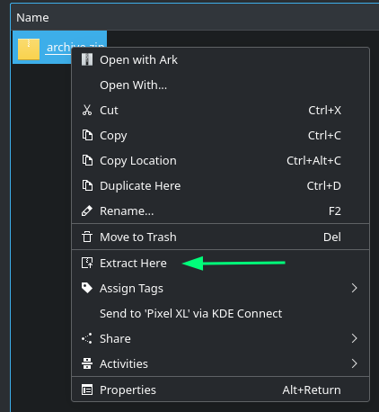
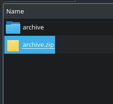

### Menu de serviço para o gerenciador de arquivos Dolphin do KDE, adiciona "Extrair aqui" ao menu de contexto de nível superior.

* Se o arquivo contém vários arquivos, eles serão extraídos para um subdiretório para evitar que um arquivo descarregue uma tonelada de arquivos no diretório atual.

